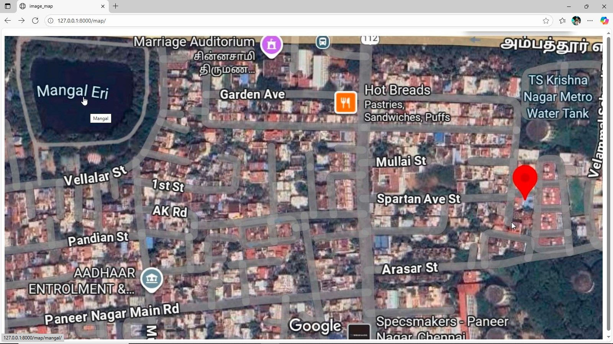
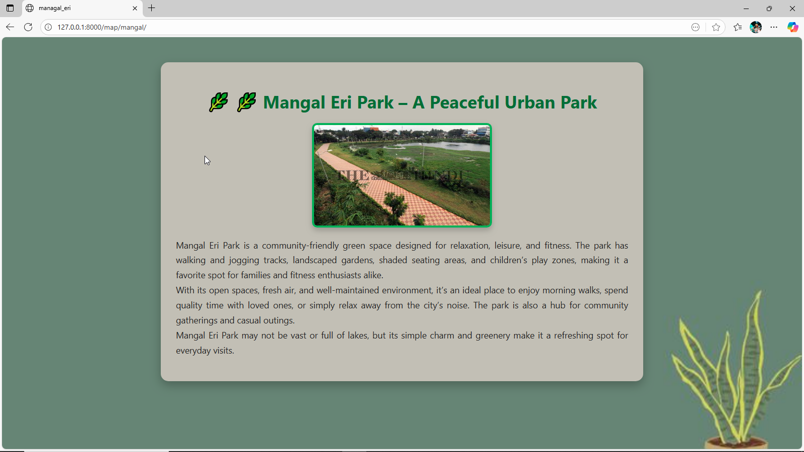
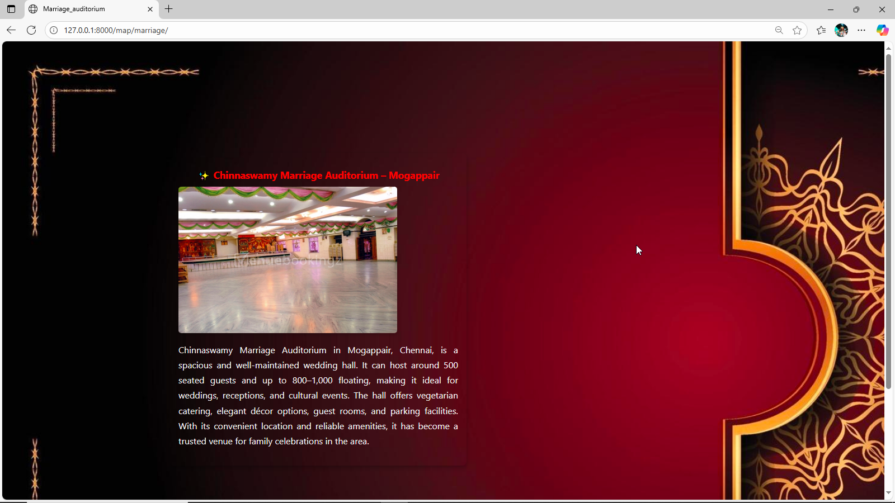
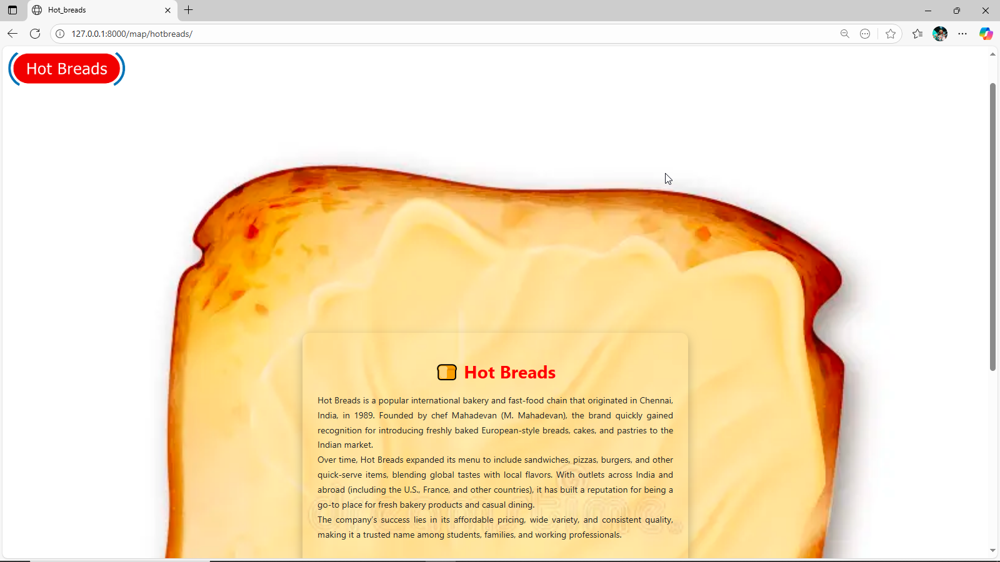
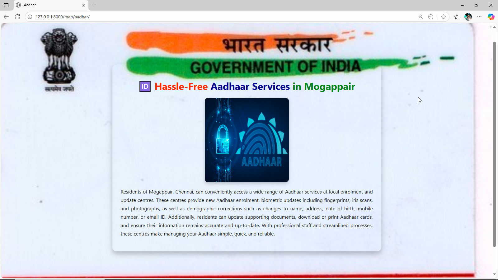
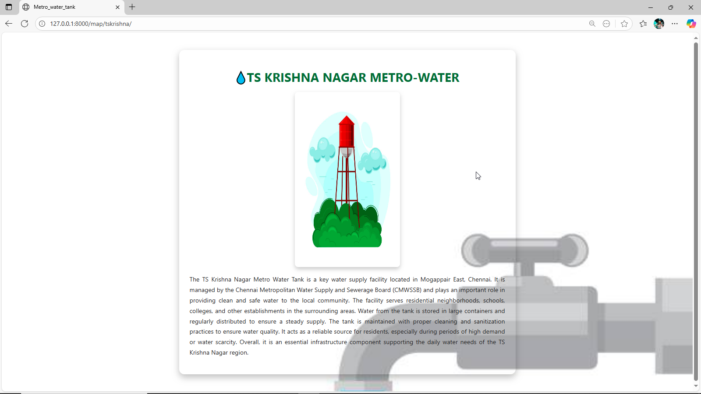

# Ex04 Places Around Me
# Date:
# AIM
To develop a website to display details about the places around my house.

# DESIGN STEPS
## STEP 1
Create a Django admin interface.

## STEP 2
Download your city map from Google.

## STEP 3
Using <map> tag name the map.

## STEP 4
Create clickable regions in the image using <area> tag.

## STEP 5
Write HTML programs for all the regions identified.

## STEP 6
Execute the programs and publish them.

# CODE
```
views.py


from django.shortcuts import render

def map(request):
    return  render(request,"map.HTML")

def mangal(request):
    return render(request, "mangal.html")
def hotbreads(request):
    return render(request, "hotbreads.html")
def marriage(request):
    return render(request, "marriage.html")
def tskrishna(request):
    return render(request, "tskrishna.html")
def aadhar(request):
    return render(request, "aadhar.html")


# Create your views here.

---

urls.py

from django.contrib import admin
from django.urls import path
from mymap import views as image_views

urlpatterns = [
    path('admin/', admin.site.urls),
    path('map/', image_views.map),
    path('map/mangal/', image_views.mangal, name="mangal"), 
    path('map/hotbreads/', image_views.hotbreads, name="hotbreads"),
    path('map/marriage/', image_views.marriage, name="marriage"),
    path('map/tskrishna/', image_views.tskrishna, name="tskrishna"),
    path('map/aadhar/', image_views.aadhar, name="aadhar"),
]

---

map.html



<!DOCTYPE html>
<html lang="en">
<head>
    <meta charset="UTF-8">
    <meta name="viewport" content="width=device-width, initial-scale=1.0">
    <title>image_map</title>
    <style>
        img{
            height: 100%;
            width: 100%;
            margin: 0%;
        }


    </style>
</head>
<body>
    
<map name="image_map" >
<area shape="poly" coords="75,80,277,93,256,224,67,215" title="Mangal" href="" alt="Mangal Eri Park">
<area shape="poly" coords="784,125,1055,124,1061,229,783,224" title="HOT_BREADS" href="" alt="HOT_BREADS">
<area shape="poly" coords="354,9,365,116,615,11,612,108" title="Marriage Hall" href="" alt="Marriage_hall">
<area shape="poly" coords="1373,96,1546,91,1543,248,1359,246" title="Metro Water" href="" alt="Metro_water">
<area shape="poly" coords="356,603,432,599,430,666,344,655,399,609,388,661,336,626,437,628,393,632,370,634,418,630,324,562,376,560,377,587,373,606,323,582,346,615,309,588,294,604" title="Aadhar Centre" href="" alt="aadhar">


    </map>
</body>
</html>

---


mangal.html


<!DOCTYPE html>
<html lang="en">
<head>
    <meta charset="UTF-8">
    <meta name="viewport" content="width=device-width, initial-scale=1.0">
    <title>managal_eri</title>
        <style>
            body {
            background-image: url("");
            background-size: cover;
            background-repeat: no-repeat;
            font-family: "Segoe UI", Tahoma, Geneva, Verdana, sans-serif;
            margin: 0;
            padding: 0;
            color: #222;
        }

        .container {
            max-width: 900px;
            margin: 50px auto;
            background:  #C1BFB5;
            padding: 30px;
            border-radius: 15px;
            box-shadow: 0px 8px 20px rgba(0,0,0,0.25);
        }

        h1 {
            text-align: center;
            color: #2f6d31;
            font-size: 2.2rem;
            margin-bottom: 20px;
        }

        h1::before {
            content: "🌿 ";
        }

        img {
            display: block;
            margin: 0 auto 20px auto;
            max-width: 100%;
            border: 4px solid #4caf50;
            border-radius: 10px;
            box-shadow: 0px 6px 12px rgba(0,0,0,0.2);
        }

        p {
            line-height: 1.7;
            font-size: 1.1rem;
            text-align: justify;
        }

    </style>


</head>

<body>
    <div class="container">
    <h1>🌿 Mangal Eri Park – A Peaceful Urban Park</h1>
    
<p>
Mangal Eri Park is a community-friendly green space designed for relaxation, leisure, and fitness. The park has walking and jogging tracks, landscaped gardens, shaded seating areas, and children’s play zones, making it a favorite spot for families and fitness enthusiasts alike.  <br>
With its open spaces, fresh air, and well-maintained environment, it’s an ideal place to enjoy morning walks, spend quality time with loved ones, or simply relax away from the city’s noise. The park is also a hub for community gatherings and casual outings.   <br>
Mangal Eri Park may not be vast or full of lakes, but its simple charm and greenery make it a refreshing spot for everyday visits.  <br>
</p></div>
</body>
</html>

---

marriage.html

<!DOCTYPE html>
<html lang="en">
<head>
    <meta charset="UTF-8">
    <meta name="viewport" content="width=device-width, initial-scale=1.0">
    <title>Marriage_auditorium</title>
    <style>
                    body {
            background-image: url("https://static.vecteezy.com/system/resources/previews/002/272/310/non_2x/luxury-mandala-ornamental-background-design-with-golden-arabesque-pattern-style-decorative-mandala-ornament-for-print-brochure-banner-cover-poster-invitation-card-vector.jpg");
            background-size: cover;
            background-repeat: no-repeat;
            font-family: "Segoe UI", Tahoma, Geneva, Verdana, sans-serif;
            margin: 0;
            padding: 0;
            color: #222;
        }

        .container {
            width: 1000px;
            margin: 400px 600px 600px 600px;
            background: transparent;
            padding: 30px;
            border-radius: 15px;
            box-shadow: 0px 8px 20px rgba(0,0,0,0.25);
        }

        h1 {
            text-align: center;
            color: red;
            font-size: 2.2rem;
            margin-bottom: 20px;
        }

        /* h1::before {
            content: " ";
        } */

        img {
            display: block;
            max-width: 100%;
            border-radius: 10px;
            box-shadow: 0px 6px 12px rgba(0,0,0,0.2); 
        }

        p {
            color: whitesmoke;
            line-height: 1.7;
            font-size: 2.0rem;
            text-align: justify;
        }
    </style>
</head>
<body>
    <div class="container">
    <h1>✨ Chinnaswamy Marriage Auditorium – Mogappair</h1>
    
<p>Chinnaswamy Marriage Auditorium in Mogappair, Chennai, is a spacious and well-maintained wedding hall. It can host around 500 seated guests and up to 800–1,000 floating, making it ideal for weddings, receptions, and cultural events. The hall offers vegetarian catering, elegant décor options, guest rooms, and parking facilities. With its convenient location and reliable amenities, it has become a trusted venue for family celebrations in the area.</p></div>
</body>
</html>

---

tskrishna.html

<!DOCTYPE html>
<html lang="en">
<head>
    <meta charset="UTF-8">
    <meta name="viewport" content="width=device-width, initial-scale=1.0">
    <title>Metro_water_tank</title>
            <style>
            body {
            background-image: url("https://media.istockphoto.com/id/2164012571/vector/water-flows-from-the-tap-onto-the-floor-vector-illustration-concept-design.jpg?s=612x612&w=0&k=20&c=4ni2TiL-9wNUmUmqrDAZ8eeAs01P6ODcIq-bygX7KeQ=");
            background-size: cover;
            background-repeat: no-repeat;
            font-family: "Segoe UI", Tahoma, Geneva, Verdana, sans-serif;
            margin: 0;
            padding: 0;
            color: #222;
        }

        .container {
            max-width: 900px;
            margin: 50px auto;
            background:  transparent;
            padding: 30px;
            border-radius: 15px;
            box-shadow: 0px 8px 20px rgba(0,0,0,0.25);
        }

        h1 {
            text-align: center;
            color: #2f6d31;
            font-size: 2.2rem;
            margin-bottom: 20px;
        }

        /* h1::before {
            content: "🌿 ";
        } */

        img {
            display: block;
            margin: 0 auto 20px auto;
            width: 300px;
            height: 500px;
            border-radius: 10px;
            box-shadow: 0px 6px 12px rgba(0,0,0,0.2);
            
        }

        p {
            line-height: 1.7;
            font-size: 1.1rem;
            text-align: justify;
        }

    </style>
</head>
<body>
    <div class="container">
    <h1>💧TS KRISHNA NAGAR METRO-WATER</h1>
    
    <p> The TS Krishna Nagar Metro Water Tank is a key water supply facility located in Mogappair East, Chennai. It is managed by the Chennai Metropolitan Water Supply and Sewerage Board (CMWSSB) and plays an important role in providing clean and safe water to the local community. The facility serves residential neighborhoods, schools, colleges, and other establishments in the surrounding areas. Water from the tank is stored in large containers and regularly distributed to ensure a steady supply. The tank is maintained with proper cleaning and sanitization practices to ensure water quality. It acts as a reliable source for residents, especially during periods of high demand or water scarcity. Overall, it is an essential infrastructure component supporting the daily water needs of the TS Krishna Nagar region.</p></div>
    </body>
</html>

---

aadhar.html

<!DOCTYPE html>
<html lang="en">
<head>
    <meta charset="UTF-8">
    <meta name="viewport" content="width=device-width, initial-scale=1.0">
    <title>Aadhar</title>
        <style>
            body {
            background-image: url("https://yourofficezone.in/images/product-images/1665322617272886175.jpg");
            background-size: cover;
            background-repeat: no-repeat;
            font-family: "Segoe UI", Tahoma, Geneva, Verdana, sans-serif;
            margin: 0;
            padding: 0;
            color: #222;
        }

        .container {
            max-width: 900px;
            margin: 200px auto;
            background: transparent;
            padding: 30px;
            border-radius: 15px;
            box-shadow: 0px 8px 20px rgba(0,0,0,0.25);
        }

        h1 {
            text-align: center;
            color: black;
            font-size: 2.2rem;
            margin-bottom: 20px;
        }

        /* h1::before {
            content: "🌿 ";
        } */

        img {
            display: block;
            margin: 0 auto 20px auto;
            height: 300px;
            width: 300px;
            border-radius: 10px;
            box-shadow: 0px 6px 12px rgba(0,0,0,0.2);
        }

        p {
            line-height: 1.7;
            font-size: 1.1rem;
            text-align: justify;
        }

    </style>
</head>
<body>
    <div class="container">
    <h1 ><span style="color: orangered;">🆔 Hassle-Free</span> <span style="color: darkblue;">Aadhaar Services </span><span style="color: green;">in Mogappair</span></h1>
    
        <p>Residents of Mogappair, Chennai, can conveniently access a wide range of Aadhaar services at local enrolment and update centres. These centres provide new Aadhaar enrolment, biometric updates including fingerprints, iris scans, and photographs, as well as demographic corrections such as changes to name, address, date of birth, mobile number, or email ID. Additionally, residents can update supporting documents, download or print Aadhaar cards, and ensure their information remains accurate and up-to-date. With professional staff and streamlined processes, these centres make managing your Aadhaar simple, quick, and reliable.</p></div>
</body>
</html>


```
# OUTPUT











# RESULT
The program for implementing image maps using HTML is executed successfully.
